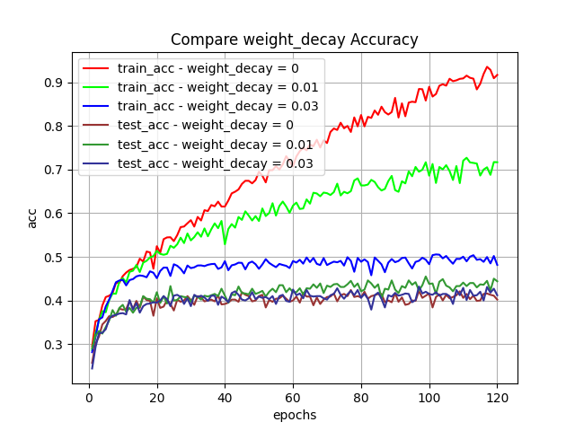
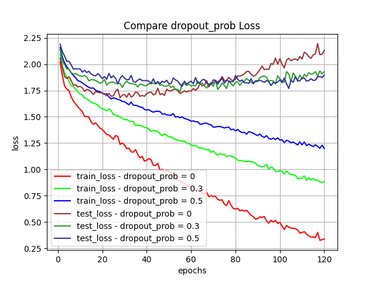
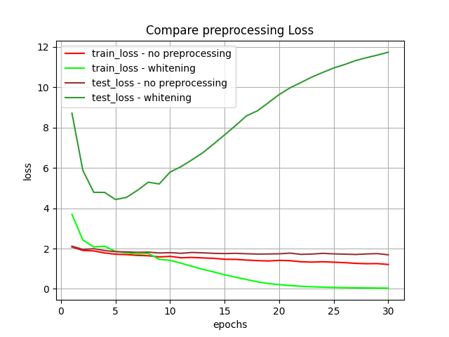

# Exercise 1 - Q2

## Table of Contents

- [Task](#task)
- [Installation](#installation)
- [Extract Dataset](#extract_dataset)
- [Usage](#usage)
- [Results](#results)

## Task

In the following you will implement a simple fully connected neural network and explore the effects
of different configurations on performance and runtime (i.e. time until convergence). For each item
below, plot the train and test losses (on the same graph), as well as the train and test accuracies (on
the same graph), as a function of the training epoch. Additionally, report the losses and accuracies
obtained by the model at the end of optimization. In each item, please incorporate the changes over
the baseline you find in item (1) below. For example, after experimenting with Xavier initialization
in item (3), do not use it in the following items.
1. Baseline - Implement a fully connected neural network with 2 layers (i.e. a single hidden
layer), hidden layer width 256, ReLU activation, and cross-entropy loss. Do not use any
form of regularization at this point. Use an SGD optimizer with momentum and a constant
learning rate, and initialize the parameters randomly by sampling from a zero-mean Gaussian distribution. Perform a grid search over the momentum coefficient, learning rate, and
initialization standard deviation, and report results for the best configuration found.
2. Optimization - Compare the best SGD configuration obtained to the usage of Adam optimizer. What are the effects of the different schemes on accuracy and convergence time?
Explain your results.
3. Initialization - Use Xavier initialization.3 How does this affect performance in terms of
accuracy and convergence time?
4. Regularization - Experiment with weight decay and dropout. How do these affect accuracy
and runtime?
5. Preprocessing - Perform PCA whitening prior to training. How does this affect results and
convergence time? You are allowed to use the sklearn implementation of PCA.
6. Network Width - Experiment with the effect of varying width by training the network with
one hidden layer using with a width of 2^i where i = 6, 10, 12. Explain your results and plot
all accuracy and loss curves of the different configurations on the same graph (one plot for
train/test loss and one for train/test accuracy).
7. Network Depth - Fix the layer width to 64, and repeat a similar experiment with varying the
depth of the network. Use depth values of 3, 4, 10. Explain your results and plot all accuracy
and loss curves of the different configurations on the same graph (one plot for train/test loss
and one for train/test accuracy).


## Installation
```sh
git clone https://github.com/AdiAlbum1/foundations-of-deep-learning-course/
cd foundations-of-deep-learning-course/EX1/Q2
pip install -r requirments.txt
```

## Extract Dataset

1. [Download dataset](https://www.cs.toronto.edu/~kriz/cifar-10-python.tar.gz)
2. Untar dataset and place it in [dataset folder](./dataset) with following structure:
    ```
    ./dataset/cifar-10-batches-py/...
    ```

## Usage
1. Training baseline model:
    ```sh
    python train_baseline_model.py
    ```
    and visualizing loss and accuracy, run:
    ```sh
    python statistics/visualize_baseline_statistics.py
    ```
2. Comparing optimization techniques:
    ```sh
    python compare_optimization.py
    ```
    and visualizing loss and accuracy, run:
    ```sh
    python statistics/visualize_optimizer_statistics.py
    ```
3. Comparing initialization techniques:
    ```sh
    python compare_initialization.py
    ```
    and visualizing loss and accuracy, run:
    ```sh
    python statistics/visualize_initialization_statistics.py
    ```
4. Comparing regularization techniques:
    ```sh
    python compare_regularization.py
    ```
    and visualizing loss and accuracy, run:
    ```sh
    python statistics/visualize_regularization_statistics.py
    ```
5. Comparing preprocessing techniques:
    ```sh
    python compare_preprocessing.py
    ```
    and visualizing loss and accuracy, run:
    ```sh
    python statistics/visualize_preprocessing_statistics.py
    ```
6. Comparing network widths:
    ```sh
    python compare_widths.py
    ```
    and visualizing loss and accuracy, run:
    ```sh
    python statistics/visualize_widths_statistics.py
    ```

## Results
1. Hyperparameter Grid Search<br/>
	For hyperparameter selection we used an exhaustive grid search over
    ```python
    stds = [0.05, 0.1, 0.3]
    learning_rates = [1e-3, 1e-2, 1e-1]
    momentums = [0, 0.5, 0.9]
    ```
    We ran the search for 100 epochs, and selected
    ```python
    std = 0.1
    learning_rate = 1e-3
    momentum = 0.9
    ```
    This gave us the following results:
    <br/>
    
    
    <br/>
    The model converged very quickly to good results, with overfitting.
    We now can use this as a basis for tuning our training procedure.

2. Optimizer Comparison<br/>
    For optimizer comparison we compared SGD with above hyperparameters and Adam optimizer.
    This gave us the following results:
    <br/>
    
    
    <br/>

3. Initialization Technique Comparison<br/>
    For initialization technique comparison we compared random normal initialization with Xavier initialization.
    This gave us the following results:
    <br/>
    
    
    <br/>

4. Regularizer Comparison<br/>
    For comparison of different regularization techniques: weight_decay and dropout.
    This gave us the following results: <br/>
    weight_decay:
    <br/>
    
    
    <br/>
    dropout:
    <br/>
    
    
    <br/>

5. Preprocessing Comparison<br/>
    For comparison of different preprocessing techniques: no-preprocessing vs whitening.
    This gave us the following results:
    <br/>
    
    
    <br/>

6. Network Widths Comparison<br/>
    For comparison of effect network width has on training.
    This gave us the following results:
    <br/>
    
    
    <br/>    