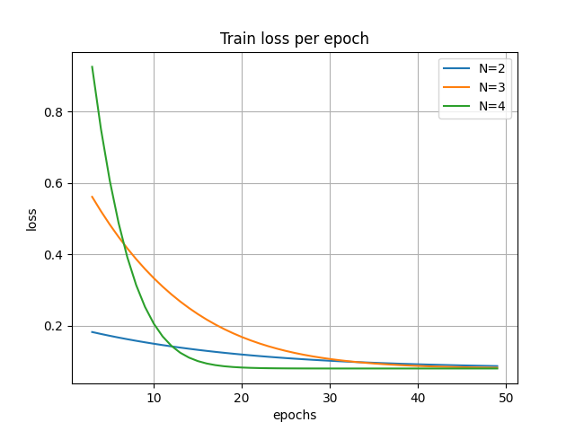
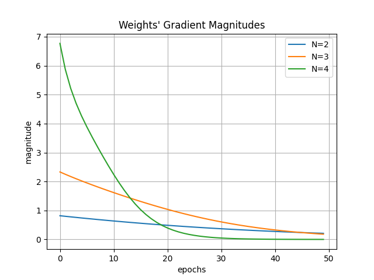
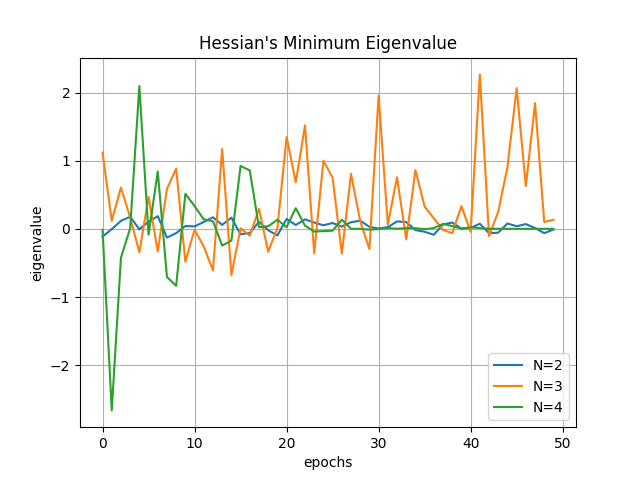
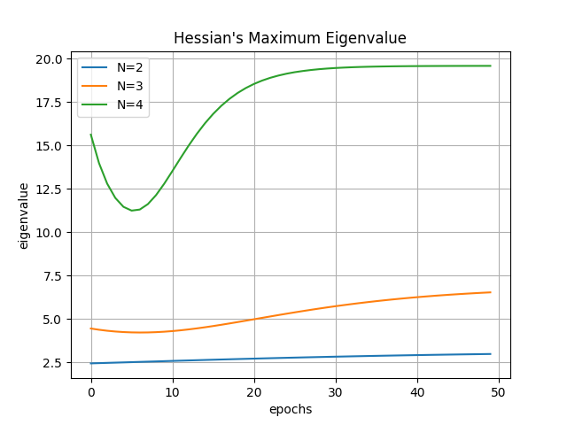

# Exercise 3 - Part 2 - Question 4

## Table of Contents

- [Task](#task)
- [Installation](#installation)
- [Extract Dataset](#extract_dataset)
- [Usage](#usage)
- [Results](#results)

## Task

On a regression dataset of your choice, train a depth N linear
neural network (with hidden widths no smaller than the minimum between input dimension
and output dimension) by minimizing l2 loss via (full batch) gradient descent with small
learning rate and initialization. Plot the objective value, the magnitude of its gradient, and
the maximal and minimal eigenvalues of its Hessian throughout the run. Explain your results.
Repeat the experiment with depths N=2,3,4


## Installation
```sh
git clone https://github.com/AdiAlbum1/foundations-of-deep-learning-course/
cd foundations-of-deep-learning-course/EX1/Part 2(4)
pip install -r requirments.txt
```

## Dataset

Dataset is a noisy sample of trigonometric tan(x)
<br/>

<br/>

## Usage
1. Training linear neural network:
    ```sh
    python train_linear_neural_network.py
    ```
2. For visualizing training procedure's train and test loss, run:
    ```sh
    python statistics/visualize_loss.py
    ```
3. For visualizing the weights' gradient magnitude throughout training, run:
    ```sh
    python statistics/visualize_weights_gradient_magnitude.py
    ```
4. For visualizing the weights' gradient Hessian min and max eigenvalue, run:
    ```sh
    python statistics/visualize_min_and_max_hessian_eigenvals.py
    ```

## Results
1. Training procedure - Train and Test Loss:<br/>
    <br/>
    
    
    <br/>

2. Weights' gradient magnitude<br/>
    <br/>
    
    <br/>

3. Weights' gradient Hessian min and max eigenvalue<br/>
    <br/>
    
    
    <br/>