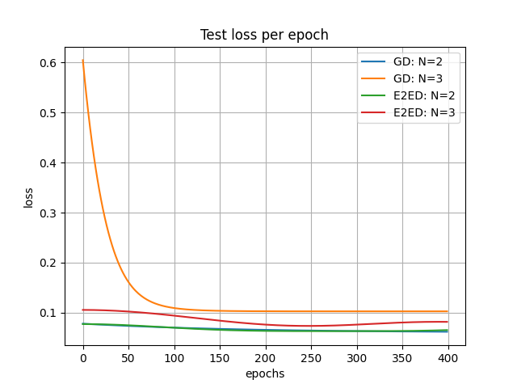
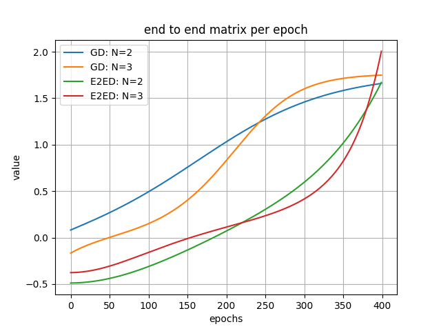

# Exercise 3 - Part 3 - Question 4

## Table of Contents

- [Task](#task)
- [Installation](#installation)
- [Dataset](#dataset)
- [Usage](#usage)
- [Results](#results)

## Task

On a scalar regression dataset of your choice, train a depth
N linear neural network (with hidden width no smaller than the minimum between input
dimension and output dimension) by minimizing l2 loss via (full batch) gradient descent with
small learning rate and initialization close to zero. Compare the trajectory taken by the endto-end matrix to that obtained by directly applying the (discrete version of the) end-to-end
dynamics to a linear model.
We repeat the experiment with depths N=2, 3

## Installation
```sh
git clone https://github.com/AdiAlbum1/foundations-of-deep-learning-course/
cd foundations-of-deep-learning-course/EX1/Part 3(4)
pip install -r requirments.txt
```

## Dataset

Dataset is a noisy sample of trigonometric tan(x)
<br/>

<br/>

## Usage
1. Training linear neural network:
    ```sh
    python train_linear_neural_network.py
    ```
2. For visualizing training procedure's train and test loss, run:
    ```sh
    python statistics/visualize_loss.py
    ```

## Results
1. Training procedure - Train and Test Loss:<br/>
    <br/>
    
    
    <br/>
2. end-to-end matrix:<br/>
    <br/>
    
    <br/>