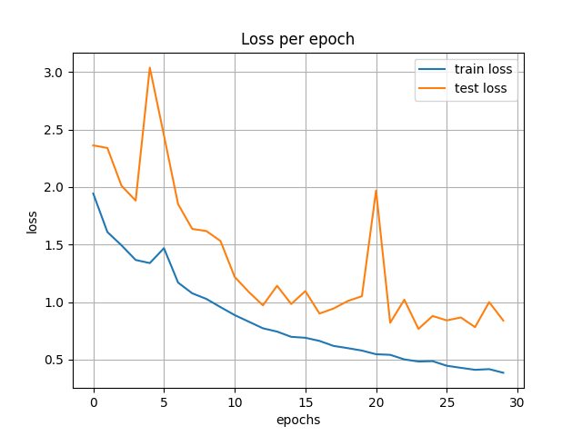
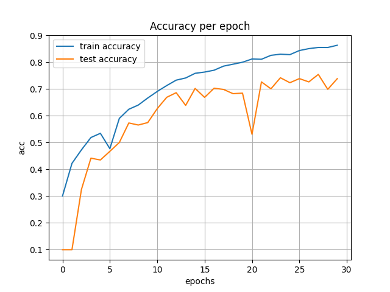
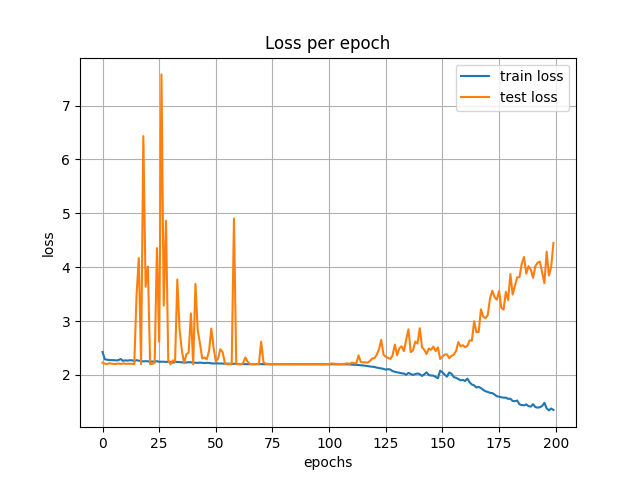
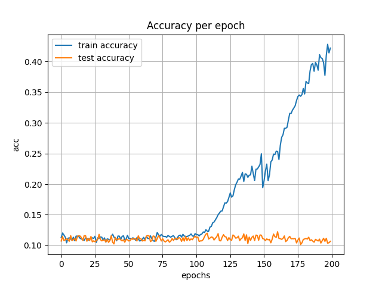
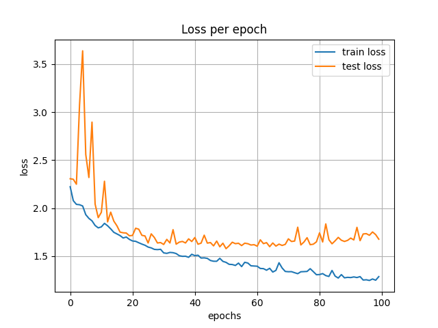
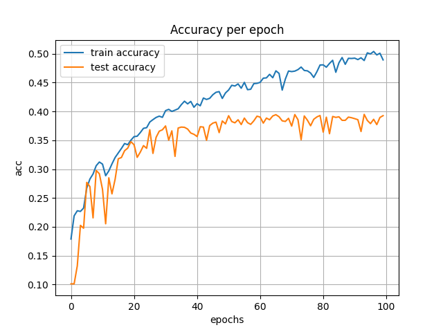
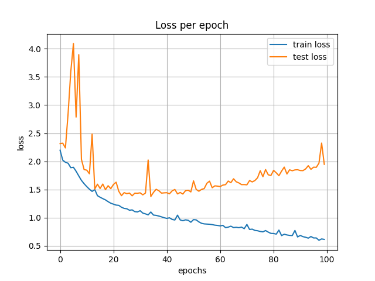
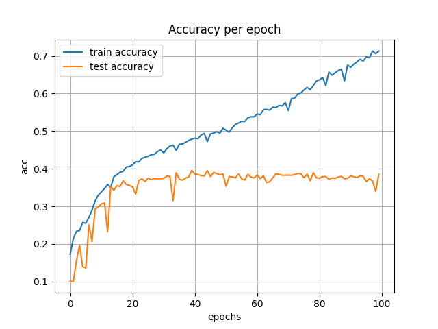

# Exercise 4 - Q1

## Table of Contents

- [Task](#task)
- [Installation](#installation)
- [Extract Dataset](#extract_dataset)
- [Usage](#usage)
- [Results](#results)

## Task

Demonstrate the four empirical postulates we relied on in class when rationalizing about generalization in deep learning.
It is recommended to work with a common classification dataset (e.g. CIFAR10) and use a
standard architecture (e.g. InceptionV3 network). In particular, you may take inspiration
from, but are free to choose the exact setting as you wish. To speed up training it is
strongly recommended to run the experiments on a GPU (e.g. on Google Colab).

## Installation
```sh
git clone https://github.com/AdiAlbum1/foundations-of-deep-learning-course/
cd foundations-of-deep-learning-course/EX4/Part 1
pip install -r requirments.txt
```

## Extract Dataset

1. [Download dataset](https://www.cs.toronto.edu/~kriz/cifar-10-python.tar.gz)
2. Untar dataset and place it in [dataset folder](./dataset) with following structure:
    ```
    ./dataset/cifar-10-batches-py/...
    ```

## Usage
```sh
python train_model.py
```

## Results
1. Training procedure on CIFAR10 - Train & Test:<br/>
    <br/>
    
    
    <br/>
2. Training procedure on random data - Train & Test:<br/>
    <br/>
    
    
    <br/>
3. Training procedure on half CIFAR10 and half random data - Train & Test:<br/>
    <br/>
    
    
    <br/>
4. Training procedure on half CIFAR10 and half adverserially labeled CIFAR10 - Train & Test:</br>
    <br/>
    
    
    <br/>